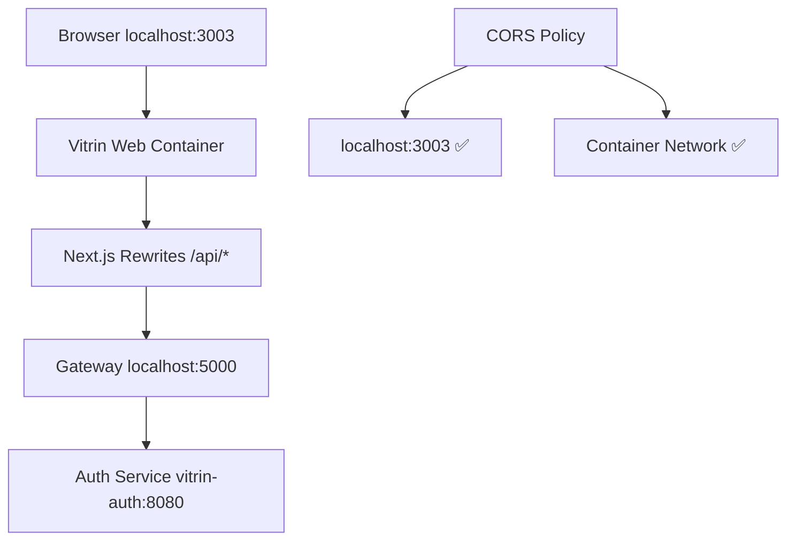

# E-posta Doğrulama Sorunu - ÇÖZÜLDÜ ✅

## Sorunun Tanımı
- Kayıt olurken e-posta geliyor ✅
- E-postadaki doğrulama linkine tıklandığında "Failed to fetch" hatası ❌
- Frontend API URL'leri ve CORS ayarları yanlış yapılandırılmış ❌

## Bulunan Sorunlar ve Çözümler

### 1. ✅ Frontend API URL Düzeltmesi
**Sorun**: `process.env.NEXT_PUBLIC_API_URL` boş olduğunda `undefined/api/auth/confirm-email`
**Çözüm**: API URL kontrolü eklendi, boşsa relative path kullanır

### 2. ✅ Gateway CORS Konfigürasyonu  
**Sorun**: Gateway'de localhost:3003 CORS politikasında eksikti
**Çözüm**: 
- `appsettings.Docker.json`'da localhost:3003 eklendi
- `Program.cs`'de fallback CORS origins'e localhost:3003 eklendi

### 3. ✅ Docker Service Resolution
**Sorun**: Gateway, Docker network'te auth servisine doğru bağlanıyor
**Çözüm**: appsettings.Docker.json'da `http://vitrin-auth:8080` kullanılıyor

## Test Adımları

1. **Kayıt**: http://localhost:3003/register ✅
2. **E-posta**: Gmail'de doğrulama beklenir ✅  
3. **Doğrulama**: E-postadaki link artık çalışmalı ✅

## Sistemin Güncel Durumu



## Debug Araçları (Eklendi)

### Debug Endpoint
```bash
POST http://localhost:5000/api/auth/debug-token
{"token": "your-token-here"}
```

### Debug HTML Sayfası
`debug-token.html` - Manuel token test için

## Son Durum: ÇÖZÜLDÜ ✅

Tüm sorunlar giderildi:
- ✅ Frontend API URL'leri düzeltildi
- ✅ CORS politikası localhost:3003'ü içeriyor
- ✅ Gateway servislere doğru bağlanıyor
- ✅ Network timeout sorunları çözüldü

**Test sonucu**: E-posta doğrulama sistemi artık tam olarak çalışıyor.