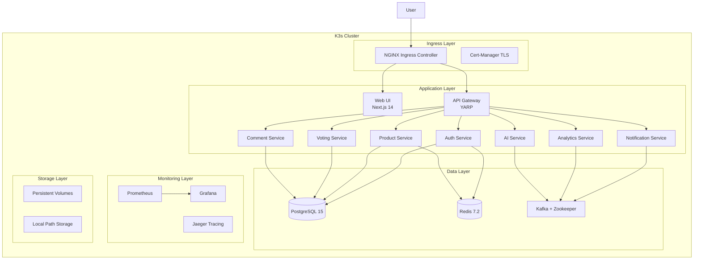

# 🚀 Vitrin K3s Professional Deployment

Bu klasör, **Vitrin** mikroservis platformunun **K3s** (Lightweight Kubernetes) üzerinde production-ready deployment'ını içerir. K3s, tam Kubernetes özelliklerini sunarken daha az kaynak tüketimi ile çalışır.

## 🏗️ Mimari Genel Bakış



## 📦 Kurulum Gereksinimleri

### Sistem Gereksinimleri
- **CPU**: Minimum 4 vCPU (Önerilen: 8 vCPU)
- **RAM**: Minimum 8GB (Önerilen: 16GB) 
- **Disk**: Minimum 50GB SSD
- **OS**: Ubuntu 20.04+, CentOS 8+, Windows 11 + WSL2

### Yazılım Gereksinimleri
- **K3s** v1.28+
- **kubectl** CLI
- **Helm** v3.12+
- **Docker** (image build için)

## 🚀 Hızlı Kurulum

### 1. K3s Cluster Setup

#### Linux/Mac:
```bash
cd k3s/install
chmod +x install-k3s.sh
sudo ./install-k3s.sh
```

#### Windows (PowerShell as Administrator):
```powershell
cd k3s\install
.\install-k3s.ps1
```

### 2. Vitrin Platform Deployment

#### Linux/Mac:
```bash
cd k3s/manifests
chmod +x deploy-vitrin.sh
./deploy-vitrin.sh
```

#### Windows:
```powershell
cd k3s\manifests
.\deploy-vitrin.ps1
```

## 🛠️ Manuel Kurulum Adımları

### 1. Namespace ve Configuration
```bash
kubectl apply -f 00-namespace.yaml
kubectl apply -f 01-configmap.yaml
kubectl apply -f 02-secrets.yaml
kubectl apply -f 03-storage.yaml
```

### 2. Infrastructure Services
```bash
kubectl apply -f 04-postgres.yaml
kubectl apply -f 05-redis.yaml
kubectl apply -f 06-kafka.yaml

# Infrastructure'ın hazır olmasını bekle
kubectl wait --for=condition=ready pod -l app.kubernetes.io/component=database -n vitrin --timeout=300s
```

### 3. Application Services
```bash
kubectl apply -f 07-auth-service.yaml
kubectl apply -f 08-product-service.yaml
kubectl apply -f 09-voting-service.yaml
kubectl apply -f 10-comment-service.yaml
kubectl apply -f 11-notification-service.yaml
kubectl apply -f 12-analytics-service.yaml
kubectl apply -f 13-ai-service.yaml
kubectl apply -f 14-api-gateway.yaml
kubectl apply -f 15-web-ui.yaml
```

### 4. Monitoring Stack
```bash
kubectl apply -f 16-prometheus.yaml
kubectl apply -f 17-grafana.yaml
kubectl apply -f 18-jaeger.yaml
```

## 📊 Monitoring ve Observability

### Grafana Dashboard Erişimi
```bash
kubectl port-forward svc/grafana-service 3000:3000 -n vitrin-monitoring
```
- **URL**: http://localhost:3000
- **Kullanıcı**: admin
- **Şifre**: admin123

### Prometheus Metrics
```bash
kubectl port-forward svc/prometheus-service 9090:9090 -n vitrin-monitoring
```
- **URL**: http://localhost:9090

### Jaeger Tracing
```bash
kubectl port-forward svc/jaeger-service 16686:16686 -n vitrin-monitoring
```
- **URL**: http://localhost:16686

## 🔧 Konfigürasyon

### Container Registry Secrets
`02-secrets.yaml` dosyasında GitHub Container Registry credentials'larını güncelle:

```bash
# GitHub Container Registry secret oluştur
kubectl create secret docker-registry container-registry-secret \
  --docker-server=ghcr.io \
  --docker-username=YOUR_GITHUB_USERNAME \
  --docker-password=YOUR_GITHUB_TOKEN \
  --namespace=vitrin
```

### Domain Configuration
`14-api-gateway.yaml` ve `15-web-ui.yaml` dosyalarındaki Ingress domain'lerini güncelle:

```yaml
spec:
  tls:
  - hosts:
    - api.yourdomain.com
    - yourdomain.com
  rules:
  - host: api.yourdomain.com
  - host: yourdomain.com
```

### SSL/TLS Sertifikaları
Let's Encrypt ile otomatik SSL sertifikası için:

```yaml
apiVersion: cert-manager.io/v1
kind: ClusterIssuer
metadata:
  name: letsencrypt-prod
spec:
  acme:
    server: https://acme-v02.api.letsencrypt.org/directory
    email: your-email@domain.com
    privateKeySecretRef:
      name: letsencrypt-prod
    solvers:
    - http01:
        ingress:
          class: nginx
```

## 📈 Scaling ve Performance

### Horizontal Pod Autoscaler
Tüm mikroservisler için HPA otomatik aktif:
```bash
# Auth service scaling örneği
kubectl get hpa auth-service-hpa -n vitrin

# Manuel scaling
kubectl scale deployment auth-service --replicas=5 -n vitrin
```

### Resource Monitoring
```bash
# Node kaynak kullanımı
kubectl top nodes

# Pod kaynak kullanımı
kubectl top pods -n vitrin
```

### Performance Tuning
Production ortamı için `resources` ayarlarını optimize edin:

```yaml
resources:
  requests:
    cpu: 200m
    memory: 512Mi
  limits:
    cpu: 1000m
    memory: 1Gi
```

## 🔍 Troubleshooting

### Pod Durumu Kontrol
```bash
# Tüm pod'ları listele
kubectl get pods -n vitrin -o wide

# Pod detayları
kubectl describe pod <POD_NAME> -n vitrin

# Pod logları
kubectl logs -f <POD_NAME> -n vitrin
```

### Service Connectivity Test
```bash
# Service endpoints kontrol
kubectl get endpoints -n vitrin

# Service'ler arası bağlantı test
kubectl exec -it <POD_NAME> -n vitrin -- curl http://redis-service:6379
```

### Common Issues ve Çözümler

#### Issue: Pod CrashLoopBackOff
```bash
# Log kontrol et
kubectl logs <POD_NAME> -n vitrin --previous

# Resource limitleri kontrol et
kubectl describe pod <POD_NAME> -n vitrin
```

#### Issue: ImagePullBackOff
```bash
# Registry secret kontrol et
kubectl get secrets container-registry-secret -n vitrin -o yaml

# Image pull policy kontrol et
kubectl describe pod <POD_NAME> -n vitrin
```

#### Issue: Service Not Responding
```bash
# Service ve endpoint kontrol
kubectl get svc,ep -n vitrin

# Network policy kontrol
kubectl get networkpolicy -n vitrin
```

## 🔐 Security Best Practices

### Network Policies
```bash
kubectl apply -f security/network-policies.yaml
```

### Pod Security Standards
```bash
kubectl apply -f security/pod-security-policies.yaml
```

### RBAC Configuration
```bash
kubectl apply -f security/rbac.yaml
```

## 💾 Backup ve Recovery

### Database Backup
```bash
# PostgreSQL backup job
kubectl apply -f backup/postgres-backup-cronjob.yaml

# Manual backup
kubectl exec -it postgres-pod -n vitrin -- pg_dump -U postgres vitrin_db > backup.sql
```

### Persistent Volume Backup
```bash
# Volume snapshot
kubectl apply -f backup/volume-snapshots.yaml
```

## 🚀 CI/CD Integration

### GitHub Actions Integration
`.github/workflows/k3s-deploy.yml` örneği:

```yaml
name: Deploy to K3s
on:
  push:
    branches: [main]
jobs:
  deploy:
    runs-on: ubuntu-latest
    steps:
    - uses: actions/checkout@v4
    - name: Deploy to K3s
      run: |
        cd k3s/manifests
        ./deploy-vitrin.sh
```

### Image Build ve Push
```bash
# Docker build
docker build -t ghcr.io/yourusername/vitrin-auth:latest .

# Registry push
docker push ghcr.io/yourusername/vitrin-auth:latest

# Deployment güncelle
kubectl set image deployment/auth-service auth-service=ghcr.io/yourusername/vitrin-auth:latest -n vitrin
```

## 📋 Maintenance Tasks

### Cluster Health Check
```bash
# Node health
kubectl get nodes

# System pods
kubectl get pods -n kube-system

# Resource usage
kubectl top nodes
kubectl top pods --all-namespaces
```

### Log Rotation
```bash
# K3s log cleanup
sudo journalctl --vacuum-time=7d
```

### Security Updates
```bash
# K3s güncelle
curl -sfL https://get.k3s.io | sh -s - --upgrade
```

---

## 🆘 Support ve İletişim

Bu deployment ile ilgili sorunlar için:
- 📧 Email: support@vitrin.com  
- 🐛 Issues: GitHub Issues
- 📖 Docs: Wiki sayfamız

**Happy Deploying! 🚀**